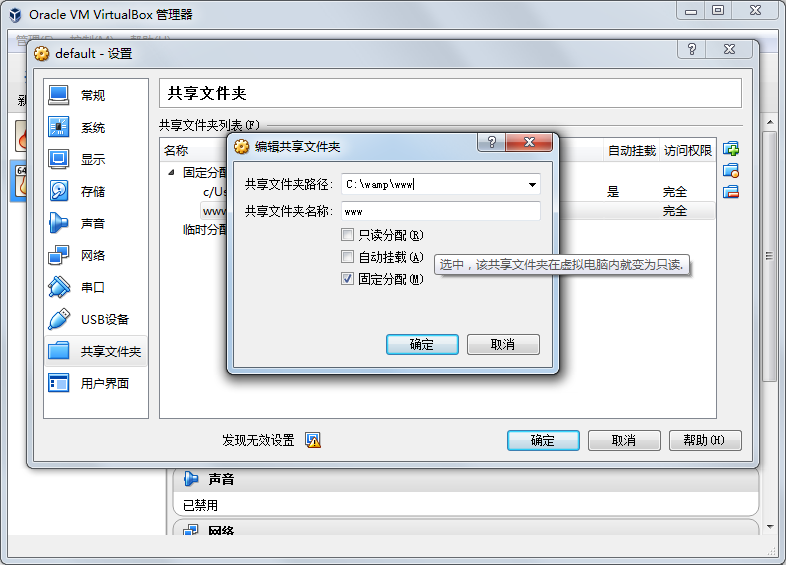
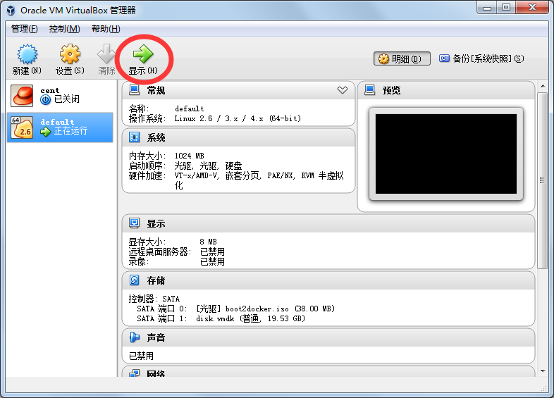
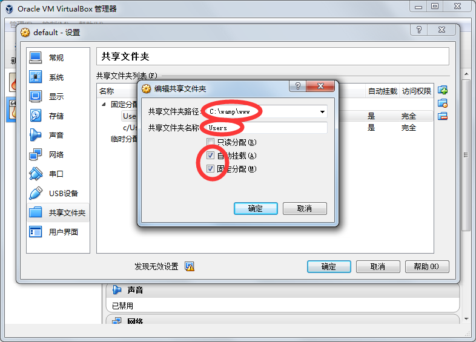
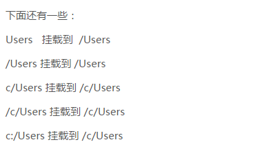

  我是一枚屌丝, 没钱买mac, 没能力玩linux命令行编程, 所以我只能在windows下砌墙代码, 比较苦逼的就是:每次代码传送到`服务器`中, 总会出现很多兼容性问题...蛋疼ing...

  虽然有很多办法可以解决, 但都必须把代码上传到相应位置(或者虚拟机中), 这样就得让*懒散*的猿类多一层手续; 就算有人说用异步同步的方法**so easy**的解决问题, 我会说我有*洁癖*,可以否?

  技术是牛逼的, docker是拯救猿类人民的, 现在终于实现了只在windows下砌代码, 在docker中运行, 也不需要去上传, 让我这个*洁癖患者*满足了一下; 不罗嗦了, 看我的**'洪荒之力'** :

# 一. 安装Docker
> 1. 下载windows下的docker工具, [下载地址](https://www.docker.com/products/docker-toolbox) 
> 2. 安装, 下一步....下一步.... (小白知道..)

# 二. 准备知识
> ### 1. docker的认识
> > windows下,docker虚拟机其实是运行在`VirtualBox`这么一个东东下的(我是这样认为的,因为安装docker工具的时候有它);这个是实现`梦想`的关键

> ### 2. docker学习
> > docker下有很多需要学习的东东, 我也不知道应该学什么, 所以....(留给大家)

# 三. 拉娶具有`LAMP`的docker镜像
> 我在使用 tutum/lamp, 拉娶方法: 
``` shell
	docker pull tutum/lamp
```
# 四. 重要的部分
> **1.** 别着急去运行: `docker run -d -p 80:80 tutum/lamp`
> **2.** 带大家去'**射**'制一下:
> > **2.1** 打开VirtualBox,你看那个像你当前运行的boot2docker,你就去'**射**'那个,反着我的是`default`
> > **2.2**  在`default`上右击->设置->共享文件; 添加一个共享文件夹,这个文件夹就是windows下砌代码的目录(项目目录);  (备注:千万把'自动挂在'勾掉)
> > **2.3**  确定后,回到主界面, 点击'**显示**'  命令行了把, 别怕:不会敲很多字母的, 
``` shell
	mkdir -p /home/docker/data
	mount -t vboxsf -o uid=1000,gid=50 www /home/docker/data
	# 备注: www:就是刚才共享文件的名称, /home/docker/data:就是一个挂载点
```
> > **2.4** 悄悄地告诉你: 要运行docker
```
	docker run -d -p 80:80 -it -v /home/docker/data:/app tutum/lamp
	# 备注: /home/docker/data:就是刚才的那个挂载点, /app:为虚拟机lamp环境的web目录
```

> <font color="red"> **\*\* 3.**  作为开发人员, 不能每次开机都做这些操作把?(现在去攻克:)</font>
> > **3.1** 在共享文件的时候应该这样玩:(注意**共享名称**),这样做的原因是: boot2docker启动的时候会自动挂载到/Users下, 通过度娘、谷狗...发现这样一段话: 也就是说这样**共享名称**都会自动挂载.(未做测试, 需自己求证....)
> > **3.2** 然后,就然后了...运行
```
	docker run -d -p 80:80 -it -v /Users:/app tutum/lamp
	# 备注: /Users 共享名称的自动挂载点, /app:为虚拟机lamp环境的web目录
```
# 五. 别等着了,已经可以运行了
> 一般为 192.168.99.100;
> 希望大家继续完善...这个很**粗**


