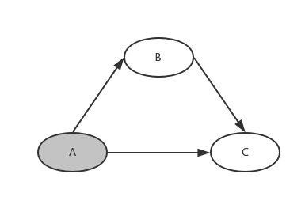

# override 与 constraint

[TOC]

## 使用 override 解决 dep 中的依赖冲突

## 使用 override 解决 dep 中的依赖冲突

2018-05-02 [#Go](https://lwhile.github.io/tag/5UKnY2CH9d)

公司的 Go 项目使用 dep 做为依赖管理的工具，在使用的过程中，因为项目依赖比较复杂，经常会遇到依赖冲突导致 `dep ensure` 命令无法执行成功。

比如，正在开发中的项目A依赖了B和C，而 B 项目也依赖了 C 项目。



A 项目的 Gopkg.toml

```toml
[[constraint]]
  branch = "master"
  name = "B"

[[constraint]]
  branch = "master"
  name = "C"
```

B 项目的 Gopkg.toml

```
[[constraint]]
  branch = "master"
  name = "C"
```

接下来 A 项目因为开发的需要在 C 项目中新开了分支。在该分支合并进 master 分支之前，需要在 A 项目的 `Gopkg.toml`中指定分支名称。

```
[[constraint]]
  branch = "master"
  name = "B"

[[constraint]]
  branch = "new_branch"
  name = "C"
```

这时候再执行 `dep ensure` 是无法成功的，会提示依赖发生了冲突。

解决冲突的方法也很简单，在A项目的 `Gopkg.toml`中将C项目的`constraint`改为 `override` 就可以了。等到C项目的修改合并进 master 分支时，再将 constraint 改回来。

```
[[constraint]]
  branch = "master"
  name = "B"

[[override]]
  branch = "new_branch"
  name = "C"
```

## constraint 与 override 的区别

dep 会如实得处理 constraint 类型的依赖，在这个例子中，尽管在 A 的依赖中将 C 的分支设置为 new_branch，但是在B项目中，引用的包还是依旧使用 master 分支 的代码。

如果将A项目的 constraint 改为 override , 则会强制让 B 项目在拉取 C 项目的代码时，拉取的是 new_branch 分支上的代码，避免因为协同开发导致的问题。


**转载: https://lwhile.github.io/post/dep-override/**

