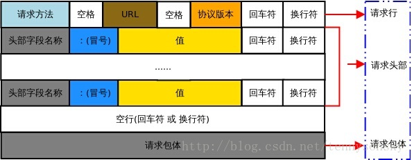

---

title: 第十九天 记录 HTTP headers理解
categories: 读书笔记
tags: 读书笔记-Python
keywords: [Python]
description: HTTP headers理解

---

[TOC]

# 第十九天 记录

在练习Python抓包的过程中, 发现对网络请求的认识不是很到位, 于是, 找了一些资料和博客介绍, 来完善这方面的空缺, 现整理如下:

## 1\. HTTP协议简介

HTTP协议，超文本传输协议，是一个属于应用层的面向对象的协议，由于其简捷、快速的方式，适用于分布式超媒体信息系统，是一个基于请求与响应模式的、无状态的、应用层的协议，常基于TCP的连接方式，HTTP1.1版本中给出一种持续连接的机制，绝大多数的Web开发，都是在HTTP协议之上的Web应用。。它于1990年提出，不断得到完善和发展。*(档来的)*

## 2\. HTTP REQUEST的组成部分

HTTP 请求报文由请求行、请求头部、空行、请求包体4个部分组成，如下图所示:


* 请求行

  * 请求行 = 方法 [空格] 请求URI [空格] 版本号 [回车换行]
  * **ps1:** GET /index.html HTTP/1.1
  * **ps2:** POST <http://192.168.2.217:8080/index.jsp> HTTP/1.1
* 消息报文(请求头部)

```
  '''
  Accept: */* 
      # 客户端可识别的响应内容类型列表，星号“ * ”用于按范围将类型分组，
        用“ / ”指示可接受全部类型，用“ type/* ”指示可接受 type 类型的所有子类型
  Accept-Language: zh-cn
      # 客户端可接受的自然语言
  Accept-Encoding: gzip, default
      # 客户端可接受的编码压缩格式
  Accept-Charset: utf-8
      # 可接受的应答的字符集
  If-Modified-Since: Wed, 17 Oct 2007 02:15:55 GMT 
  If-None-Match: W/"158-1192587355000" 
  User-Agent: Mozilla/4.0 (compatible; MSIE 6.0; Windows NT 5.1; SV1) 
      # 请求的浏览器类型
  Referer: http://www.xidian.com/index.jsp 
      # 代表当前网页的来源 防止盗链
  Host: 192.168.2.162:8080 
      # 请求的主机名，允许多个域名同处一个IP 地址，即虚拟主机
   Connection: Keep-Alive
       # 连接方式(close或keepalive)
   Cookie: XXXXX
        # 存储于客户端扩展字段，向同一域名的服务端发送属于该域的cookie
   Origin: 域名
   Authorization: 请求报头域主要用于证明客户端有权查看某个资源, 一般为base64编码
   '''

```
* 空行 

  * 最后一个请求头之后是一个空行，发送回车符和换行符，通知服务器以下不再有请求头
* 实体内容(请求正文)

  * 请求包体不在GET方法中使用，而是POST方法中使用。 POST方法适用于需要客户填写表单的场合。
  * 与请求包体相关的最常使用的是包体类型Content-Type和包体长度Content-Length

## 3\. HTTP REQUEST请求方法

* GET
* HEAD
* POST
* DELETE
* PUT
* CONNECT
* OPTIONS
* TRACE

**ps:** 常用的只有`GET`和`POST`, 而区分`POST`的请求一般依靠**Content-Type: application/x-www-form-urlencoed**, 多个数据之间用&分隔（name=value&name=value&name=value）, 在python中使用`urllib.urlencode({'name':'value'})`

---

**参考:**
[HTTP协议学习篇（一）—http请求 -摘客](http://zkread.com/article/1293359.html)
[HTTP协议浅析(中)：请求报文和响应报文 -摘客](http://zkread.com/article/1216562.html)
[HTTP request methods](https://developer.mozilla.org/en-US/docs/Web/HTTP/Methods)
[HTTP - Requests](https://www.tutorialspoint.com/http/http_requests.htm)
[List of HTTP header fields](https://en.wikipedia.org/wiki/List_of_HTTP_header_fields)

**推荐工具:**
[在线HTTP请求工具](http://www.atool.org/httptest.php)

Author [@Snaker95](http://www.sharedsea.com)