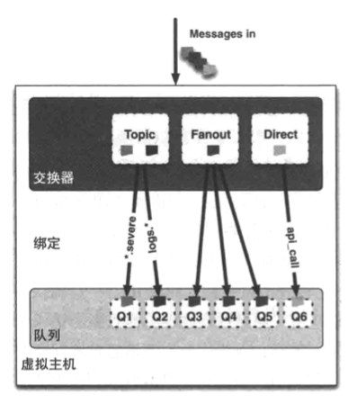
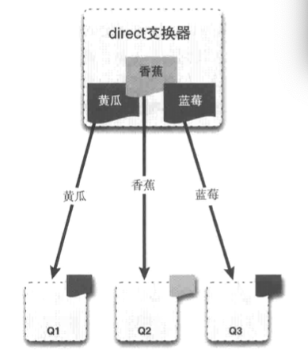
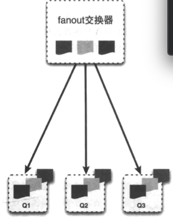
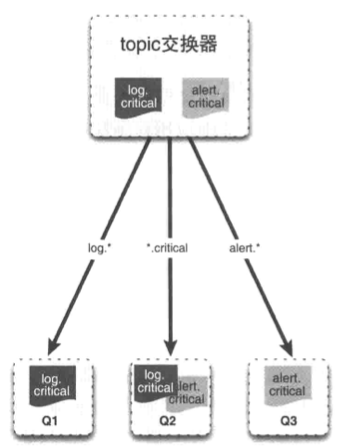

# 第一天

## Rabbit 概念

### 消息通信

* 消费者 comsumer
* 生产者 producer
* 代理 proxy

### AMQP元素 Advanced Message Queuing Protocol

* 交换机 exchange
* 队列 queue
* 绑定 bind

### 消息

* 概念:
  * 包含 有效载荷(payload) 和 标签(label)
    * payload: 传输的数据
    * label: 描述了有效的payload, 并确定获取消息拷贝的消费者, 不发送给消费者
  * 过程
    * producer 创建消息, 发布到 代理服务器(RabbitMQ), 代理服务器根据label将 payload 发送给消费者

### 信道 channel

* 程序与Rabbit之间建立的连接, AMQP信道, 是建立在TCP连接内的虚拟连接

### AMQP消息路由

* 交换器
* 队列
* 绑定
* 


### 消息队列

* 发送和确认
  * 消费者在接收到消息后, 发送确认接受
  * 消息在被确认接受之前不会从队列中删除
  * 消费者在确认之前不会再接受其他消息
* 拒绝
  * 将消费者从RabbitMQ服务器断开 (**不推荐**)
  * RabbitMQ 2.0以上版本, basic.reject命令
* 创建队列
  * 生产者创建队列
  * 消费者创建队列
    * 在同一条信道上订阅里其他队列就无法创建队列
  * 参数
    * exclusive --- true为私有队列, 限定一个队列只有一个消费者
    * auto-delete --- 不存在消费者的时候自动移除, 临时队列
  * 哪个角色创建队列比较好?
    * 生产者和消费者都尝试创建队列比较好

### 交换器

* 消息 -> 交换器 -> 队列
* 通过routing key(路由键)
* 交换器类型
  * direct
    * 路邮件匹配法
    * 
    * `$channel->basic_publish($msg, '', 'queue-name )`; `$msg`是消息内容; ''空字符串指定默认交换器; 'queue-name' 是路由键
  * fanout
    * 将消息投递给所有附加在交换器上的队列
    * 
  * topic
    * 感觉像direct的升级版, 可以通过正则方式将消息分发到不同的队列
    * 
  * headers
    * 匹配AMQP消息的header
    * 很少用到, 性能相比较差


### 虚拟主机和隔离


### 消息的一生

1. 安装RabbitMQ的docker服务
2. 使用Python实现生产者和消费者

#### 安装RabbitMQ的docker服务

```shell
docker run -d --restart=on-failure:10 --hostname rabbit-test --name RabbitTest -p 5672:5672 -p 15672:15672 rabbitmq:3.8-management
```

* 安装RabbitMQ3.8, Web管理端口: 15672, 默认用户名密码: guest/guest


### 使用RabbitMQ的基本步骤

* 连接RabiitMQ (注意: 每一步的参数, 以及作用)
  * 初始化认证, 包括用户/密码
  * 初始化连接的IP, 以及虚拟机vhost, 和认证类
  * 连接服务器, 创建信道
* 消费者
  * 声明交换器名称, 以及交换器类型
  * 通过routing_key绑定队列到交换器
  * 注册消费者, 注意回调函数以及其参数
  * 开始监听
* 生产者
  * 声明交换器名称, 以及交换器类型
  * 创建消息类
  * 发布消息到交换器以及routing_key;

### VHOST 创建

* rabbitmqctl add_vhost [vhost_name]

### 消息持久化

* 属性 durable