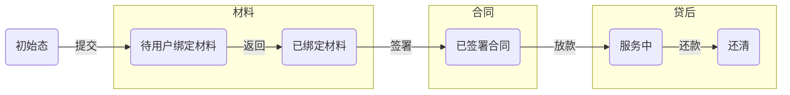

数据库管理

* 网页管理工具: DBninja

  * libreoffice 	

| 起始状态码 | 最终状态码 | 事件                        | 事件描述                                       |
| ---------- | ---------- | --------------------------- | ---------------------------------------------- |
| 0          | 0          | create_order                | 创建订单                                       |
| 10010      | 10010      | save_user_work_info         | 信审审核系统保存用户工作信息                   |
| 10010      | 10010      | can_aegis_update_order      | 信审是否可以更新用户信息                       |
| 10010      | 10010      | save_user_basic_info        | 信审审核系统保存用户基本信息                   |
| 10010      | 10010      | save_user_driver_license    | 信审审核系统保存用户驾驶证相关信息             |
| 10010      | 10010      | save_user_coborrower_info   | 信审审核系统保存用户共借人信息                 |
| 10010      | 10030      | reject_qualification_audit  | 初审拒绝                                       |
| 10010      | 10050      | qualification_audit_pass    | 初审通过                                       |
| 10030      | 10030      | can_refund                  | 初审拒绝，允许退款                             |
| 10030      | 99999      | cancel                      | 初审拒绝，订单放弃                             |
| 10050      | 40010      | submit_materials_audit      | 提交材料审核                                   |
| 30050      | 50350      | pass_loan_material_audit    | 放款材料并行审核通过                           |
| 40010      | 40020      | return_materials_audit      | 材料审核驳回                                   |
| 40010      | 40030      | reject_materials_audit      | 材料审拒绝                                     |
| 40010      | 40050      | materials_audit_pass        | 材料审核通过，待确认产品                       |
| 40020      | 40020      | save_images_info            | 材料审核驳回，提交用户影像信息                 |
| 40020      | 40020      | save_coborrow_info          | 材料审核驳回，提交用户信息                     |
| 40020      | 40020      | save_user_id_card           | 材料审核驳回，保存用户身份证相关信息           |
| 40020      | 40020      | save_user_info              | 材料审核驳回，提交用户信息                     |
| 40050      | 40050      | save_product                | 材料审核通过，选产品                           |
| 40050      | 40110      | auto_launch_compass_routing | 材料审核通过，自动发起资金路由                 |
| 40050      | 40110      | product_confirmed           | 确认产品，发起资金路由                         |
| 40110      | 40130      | fund_final_audit_fail       | 资方终审失败                                   |
| 40110      | 40150      | fund_final_audit_pass       | 资方终审通过                                   |
| 40150      | 40110      | skip_current_lending_bank   | 资方终审成功，跳过当前资方                     |
| 40150      | 40150      | reset_loan_audit            | 重置放款审核                                   |
| 40150      | 40150      | submit_lend_preaudit        | 提交放款预审核                                 |
| 40150      | 50250      | contract_signed             | 已签署合同                                     |
| 40150      | 50310      | loan_material_audit         | 资方终审通过，开始放款材料审核                 |
| 50250      | 30050      | down_payment_done           | 已首付                                         |
| 50250      | 40150      | return_contract_audit       | 合同被放款审核驳回，订单状态回退到资方终审通过 |
| 50350      | 60010      | submit_fund_loan            | 放款中                                         |
| 50350      | 60050      | loaned                      | 已放款                                         |
| 60050      | 60150      | pay_off                     | 已结清                                         |

| 版本号 | 状态码 | 状态描述     | 子系统标识          |
| ------ | ------ | ------------ | ------------------- |
| 8      | 0      | 未生效       |                     |
| 8      | 10010  | 初审中       | credit_audit_status |
| 8      | 10030  | 初审拒绝     | credit_audit_status |
| 8      | 10050  | 初审通过     | credit_audit_status |
| 8      | 40010  | 材料审核中   | credit_audit_status |
| 8      | 40020  | 材料审核驳回 | credit_audit_status |
| 8      | 40030  | 材料审核拒绝 | credit_audit_status |
| 8      | 40050  | 材料审核通过 | credit_audit_status |
| 8      | 40110  | 资方终审中   | compass_status      |
| 8      | 40130  | 资方终审拒绝 | compass_status      |
| 8      | 40150  | 资方终审通过 | lend_audit_status   |
| 8      | 99999  | 已放弃       |                     |

