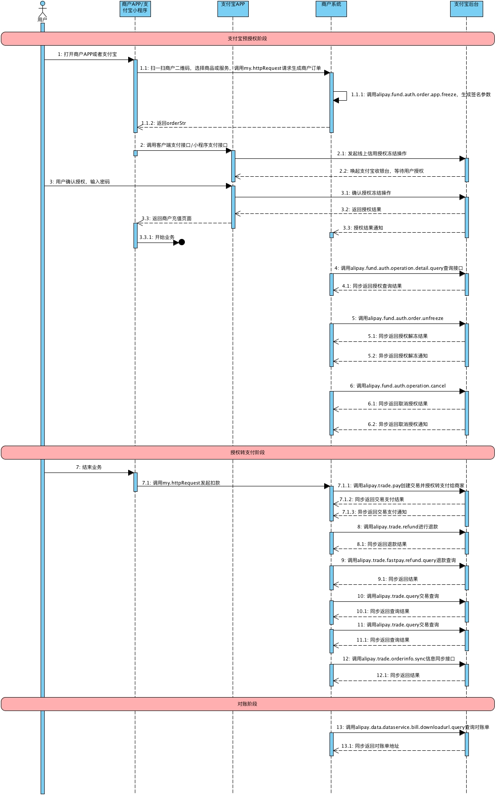

## 支付宝免押

使用免押采用的是 **支付宝预授权** 这款产品, 详细介绍 https://docs.open.alipay.com/20180417160701241302/intro/

视频介绍: https://xueyuan.alipay.com/college/187.htm 

## 支付宝免押接入步骤

#### 第一步: 签约预授权 (审核需要2-3工作日)

1. 填写基础信息
   1. 服务名称
   2. 服务logo
   3. 联系人电话
   4. 联系人邮箱
2. 配置准入条件
   1. 创建品类
   2. 芝麻分门槛
   3. 风控评估等级
   4. 最高额度上限
   5. 消费笔数上限
   6. 支持部分减免
   7. 设置芝麻分对应的额度
3. 配置信用守护
   1. 客服电话
   2. 其他选填项
      1. 待还款订单守约方式: 跳转到小程序 或者 文字提示
      2. 提前结束
      3. 买断
      4. 延期
      5. 换新
      6. 维修

#### 第二步: 配置信用服务

1. 提交表单, 签约审核

#### 第三步: 创建应用并完成技术对接

1. 技术同学接入 技术文档 https://docs.open.alipay.com/20180417160701241302/litbla/

## 支付宝免押接口接入流程

## 技术对接逻辑

| **接口名称**           | **接口英文名**                                               | **描述**                                                 | **使用场景**                                                 |
| ---------------------- | ---------------------------------- | -------------------------------- | ------------------------------------------------------------ |
| 预授权授权             |                                                              | h5页面/App端授权操作                                     | 支付宝用户同意授权                                           |
| 预授权冻结接口         | [alipay.fund.auth.order.app.freeze](https://docs.open.alipay.com/api_28/alipay.fund.auth.order.app.freeze/) | 通过调用该接口创建支付宝授权订单并完成预授权             | ISV使用此接口唤起在APP内唤起支付宝收银台；用户在收银台中确认金额后预授权成功 |
| 预授权撤销接口         | [alipay.fund.auth.operation.cancel](https://docs.open.alipay.com/api_28/alipay.fund.auth.operation.cancel) | 通过调用该接口撤销授权冻结操作                           | 只有发生授权系统超时或者授权结果未知时可调用撤销，其他正常授权冻结的操作如需实现相同功能请调用资金授权解冻服务。提交资金授权后调用【资金授权操作查询】，没有明确的授权结果再调用【资金授权撤销】 |
| 预授权解冻接口         | [alipay.fund.auth.order.unfreeze](https://docs.open.alipay.com/api_28/alipay.fund.auth.order.unfreeze) | 支持部分和全部解冻                                       | 当资金授权发生之后一段时间内，由于买家或者商家等其他原因需要要解冻资金，商家可通过资金授权解冻接口将授权资金进行解冻，支付宝将在收到解冻请求并验证成功后，按解冻规则将冻结资金进行解冻，原路退回支付宝账号 |
| 预授权操作查询接口     | [alipay.fund.auth.operation.detail.query](https://docs.open.alipay.com/api_28/alipay.fund.auth.operation.detail.query) | 通过调用该接口查询授权操作明细信息                       | 商家后台、网络、服务器等出现异常，商户系统最终未接收到支付通知；调用资金授权冻结接口后，返回系统错误或未知交易状态情况；注意：调用撤销接口之前，需通过操作查询接口确认该笔授权操作目前的状态（返回结果status=”SUCCESS”表明授权操作成功）。当商家调用“资金授权解冻接口”时出现系统错误，商户可使用该接口查询提交的解冻请求是否执行成功。 |
| 交易创建并支付接口     | [alipay.trade.pay](https://gw.alipayobjects.com/os/rmsportal/UkoSRNhRZnSjQciiPFBu.pdf) | 通过调用该接口创建支付宝交易订单并使用预授权资金完成支付 | 当商家需要对用户授权资金进行解冻支付时，商家可通过交易创建并支付接口将用户授权资金支付给卖家，支付宝将在收到请求后创建相应交易单并将授权资金支付给卖家 |
| 交易同步退款接口       | [alipay.trade.refund](https://docs.open.alipay.com/api_1/alipay.trade.refund) | 支持部分和全部退款                                       | 当交易发生之后一段时间内，由于买家或者卖家的原因需退款，卖家可通过退款接口将支付款退还给买家，支付宝将在收到退款请求并验证成功后，按退款规则将支付款按原路退到买家帐号上 |
| 交易订单查询接口       | [alipay.trade.query](https://docs.open.alipay.com/api_1/alipay.trade.query) | 通过调用该接口查询订单的状态                             | 商户后台、网络、服务器等出现异常，商户系统最终未接收到支付通知 |
| 统一收单交易退款查询   | [alipay.trade.fastpay.refund.query](https://docs.open.alipay.com/api_1/alipay.trade.fastpay.refund.query) | 通用调用该接口查询                                       | 商户可使用该接口查询自已通过alipay.trade.refund或alipay.trade.refund.apply提交的退款请求是否执行成功。 该接口的返回码10000，仅代表本次查询操作成功，不代表退款成功。如果该接口返回了查询数据，且refund_status为空或为REFUND_SUCCESS，则代表退款成功，如果没有查询到则代表未退款成功，可以调用退款接口进行重试。重试时请务必保证退款请求号一致。 |
| 查询对账单下载地址     | [alipay.data.dataservice.bill.downloadurl.query](https://docs.open.alipay.com/api_15/alipay.data.dataservice.bill.downloadurl.query) | 商户通过本接口获取商户离线账单下载地址                   | 为方便商户快速查账，支持商户通过本接口获取商户离线账单下载地址 |
| 支付宝订单信息同步接口 | [alipay.trade.orderinfo.sync](https://docs.open.alipay.com/api_1/alipay.trade.orderinfo.sync) | 商户向支付宝同步该笔订单相关业务信息                     | 使用场景：1、预授权订单为全信用或者部分信用授权订单；2、针对授权转支付扣款失败的订单，请在首次授权转支付失败T+N之后调用该接口（如果是同步用户违约状态，则转失败15天后同步）；3、orderInfo中的status包含：COMPLETE(用户已履约)、VIOLATED(用户已违约)；4、COMPLETE(用户已履约)：如果用户通过其他方式完成订单支付，请反馈该状态，芝麻将对用户形成一条良好履约记录；5、VIOLATED(用户已违约)：如果用户在约定时间（具体根据行业约定，可联系BD）内未完成订单支付，反馈该状态，芝麻将对用户记录一条负面记录； |

## 接入规划

| 工作项                                           | 描述                                                         | 相关人 |
| ------------------------------------------------ | ------------------------------------------------------------ | ------ |
| 支付宝账户管理员开通对应的支付宝产品(信用预授权) | 根据以上流程, 开通对应的产品                                 |        |
| 风控(RI)制定对应分值减免的押金额度               | 由于芝麻分值和减免金额设计风控部门, 具体的参考值有风控部门给出 |        |
| 技术(RD)完成demo, 进行支付验证                   | 可下载支付宝的 demo, 配置对应的 key 和 secret                |        |
| 产品(PM)规划流程和支付场景                       | 产品需根据场景设计产品逻辑和记账场景以及异常情况处理. 保证用户体验流畅, 和使用场景的合法性 |        |
| 技术(RD)根据产品逻辑进行详设                     | 技术通过产品逻辑进行详细设计, 完成免押支付                   |        |
| 客服(CS)话术                                     | 由于新的支付方式接入, 需要客服了解和解答用户问题;            |        |
| 财务(AF)对账                                     | 财务对新的支付方式进行了解和对账                             |        |
|                                                  |                                                              |        |