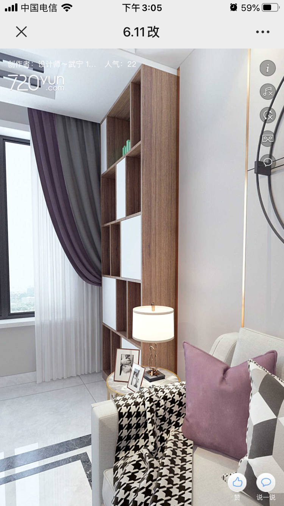

# 装修

[TOC]

## 拆切阶段

1. 拆改主卧和次卧门

## 水电阶段

1. 改水

   1. 隐藏式改水
   2. 洗脸池改为墙排

2. 改电

   1. 网线升级为 6 类线

   

## 瓦工阶段

## 木工阶段

客厅: 

* 书柜
  * 
* 沙发吊顶
* 晾衣架吊顶
  * 电线走顶槽
* 窗口套*2

廊厅:

* 玄关柜
  * 
    * 坐凳
      * 总高 40-45cm, 长: 92cm(紧贴墙)
      * 底部留 10cm 的空档,(放鞋)
      * 做 1 个大抽屉 (放拖鞋)
    * 柜台
      * 总高 80-85cm, 长是 100cm
    * 柜台上方
      * 如图
    * 柜台吊柜
      * 正常做
    * 衣柜
      * 总高: 顶梁, 长度: 165cm
      * 三开门
  * 
* 门顶吊顶

卫生间过道:

* 次卧门置物架
  * 武老板 效果图中
* 主卧门储物间
  * 
* 卫生间外大门门套

厨房:

* 地柜
* 顶柜
* 厨房门套
* 窗口套

次卧:

* 榻榻米
  * 留边沿
* 主桌
* 次卧门套
* 窗口套

主卧:

* 衣柜
* 门套
* 窗口套

## 油工阶段

## 安装阶段

## 软装阶段

