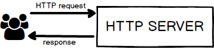
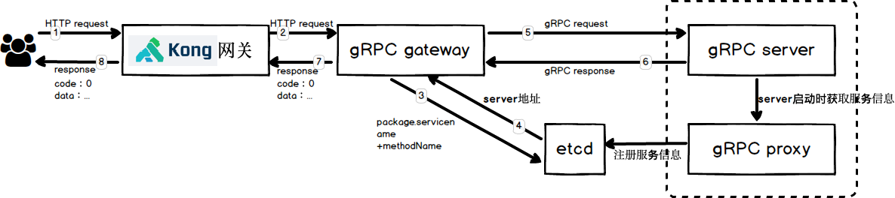
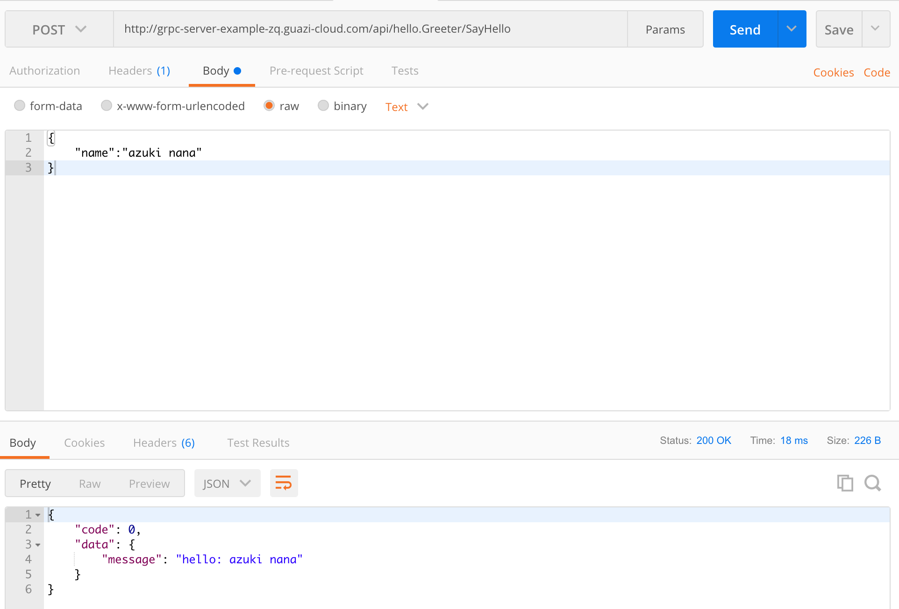
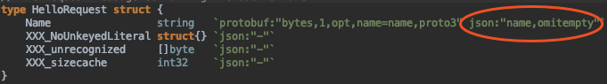

# Gin框架转gRPCx框架

### 介绍

Gin框架转到gRPCx框架后，架构将会发生如下变化，

### 原先的http框架



### 将会变为



### 优势

- 统一接入、统一管理：使用Kong网关作为客户端和消费端接入微服务的唯一入口，在网关可以进行统一的服务接入，流量控制，安全防护，限流熔断以及性能监控。同时，只需简单的配置即可将开发的服务发布出去。因此服务的开发者便捷地对外提供服务。详细介绍请见[kong网关简介](http://cwiki.guazi.com/pages/viewpage.action?pageId=74616352)。
- 服务自动注册：采用sidecar的方式部署gRPC proxy与gRPC server实现了服务自动注册，当服务启动时gRPC proxy获取gRPC server上的service信息，并将这些service及method注册到etcd配置中心中。详细介绍见[grpc-proxy(bridge)](http://cwiki.guazi.com/pages/viewpage.action?pageId=67820086)。
- 服务自动发现：使用gRPC gateway，根据客户端传的packageName.serviceName/methodName到etcd中进行服务发现，找到对应的gRPC server地址，然后发起gRPC请求。详细介绍见[gRPC gateway](http://cwiki.guazi.com/display/xn/gRPC+gateway)。
- 同时支持gRPC请求与HTTP请求，可满足业务环境的多样化需求。
- 解决了跨域问题。

### 流程

http客户端发起post请求kong网关地址，kong网关将请求转发到gRPC gateway，根据**packageName.serviceName+methodName**到etcd配置中心中查找对应的server地址，然后向gRPC server发起请求，gRPC server返回后，gRPC gateway将返回值按瓜子response要求处理后返回给前端。

# 迁移

### 后台

后台框架需要完全重写，由原先的http server转换为gRPC server。

原先我们通过gin实现一个HTTP server可以这样做

```go
import (
   "net/http"
 
   "github.com/gin-gonic/gin"
)
 
func setupRouter() *gin.Engine {
   // Disable Console Color
   // gin.DisableConsoleColor()
   r := gin.Default()
 
   // Ping test
   r.GET("/helloGreeter.SayHello/:name", func(c *gin.Context) {
      user := c.Params.ByName("name")
      c.String(http.StatusOK, "hello"+user)
   })
   return r
}
 
func main() {
   r := setupRouter()
   // Listen and Server in 0.0.0.0:8080
   r.Run(":8080")
}
```

如果我们使用gRPCx去实现server应该这样做

首先编写.proto文件，后续http客户端可以根据把proto文件当做接口描述，用来发起请求。

```proto
// The greeting service definition.
service Greeter {
  // Sends a greeting
  rpc SayHello (HelloRequest) returns (HelloReply) {}
}
 
// The request message containing the user's name.
message HelloRequest {
  string name = 1;
}
 
// The response message containing the greetings
message HelloReply {
  string message = 1;
}
```

然后通过proto工具生成.pb.go文件

```
$ protoc -I helloworld/ helloworld``/helloworld``.proto --go_out=plugins=grpc:helloworld
```

注：protocol buffers v3工具获取方式参考https://grpc.io/docs/quickstart/go.html#install-protocol-buffers-v3

创建gRPC server

```go

import (
   "context"
   "fmt"
   "os"
   "os/signal"
   "syscall"
 
   "golang.guazi-corp.com/tools/alice/grpcx"
   pb "golang.guazi-corp.com/tools/alice/grpcx/example/hello"
)
 
type helloGreeter struct {
}
 
func (h *helloGreeter) SayHello(ctx context.Context, in *pb.HelloRequest) (*pb.HelloReply, error) {
   return &pb.HelloReply{Message: fmt.Sprintf("Hello: %s", in.Name)}, nil
}
 
func main() {
   sigChan := make(chan os.Signal, 1)                             // 退出信号
   defer close(sigChan)
   signal.Notify(sigChan, syscall.SIGINT, syscall.SIGTERM)
   server := grpcx.NewServer(8080)                                // 初始化server
   pb.RegisterGreeterServer(server.GrpcServer(), &helloGreeter{})
   go func() {
      if err := server.Start(); err != nil {                      // 启动server
         panic(err)
      }
   }()
   <-sigChan
   server.Stop()                                                  // 停止server
}
```

以往我们在gin框架中实现了认证、权限管理等功能，在gRPCx框架中我们是以中间件的形式实现的（gPRC-middleware详细介绍[gRPCx-middleware](http://cwiki.guazi.com/display/xn/gRPCx-middleware)），使用方法如下。

```go
import (
   "golang.guazi-corp.com/tools/alice/grpcx_middleware/metadata"
   "golang.guazi-corp.com/tools/alice/grpcx_middleware/metrics"
)
 
 
...
grpcx.AddInterceptorLayer(
   "hello.Greeter",
   &metadata.Interceptor{},
```

gRPCx支持不同的service使用不同的中间件，目前已经实现了有认证、权限、埋点的中间件，这样使用起来更加灵活。可以针对不同的service定义中间件。

**注：grpc server中如果需要加入日志、埋点等功能，为后续监控、报警使用，可以使用alice相关组件，具体请参考[日志、监控及告警](http://cwiki.guazi.com/pages/viewpage.action?pageId=71617103)。**

### 部署

需要通过sidecar的方式部署gPRC proxy+gRPC server

med.yml示例如下：

```yml
# repo 模块，配置在registry里面的repo名字和在k8s里面的namespace名
repo:
  name: gRPC-server-example         # repo name, 一般一个git一个name，不可和其他组的name重复
  project: zhangqian29         # project name，一般一个组一个name，或者一个大组一个，各组不可重复
 
# build 模块，用于编译二进制文件
build:
  - name: build                                               # build 镜像名，用于release copy编译好的二进
    image: tools/golang:latest
    workdir: /go/src/git.guazi-corp.com/zhangqian29/gRPC-server-example
    copy:
      - . /go/src/git.guazi-corp.com/zhangqian29/gRPC-server-example
    run:
      - go build -o grpc_server gRPCx_server.go
 
 
  - name: release-grpcserver
    image: tools/centos:7.4-latest                              # 运行环境基础镜像，由medusa团队提供和维护
    copy_from:                                                # copy build好的二进制文件和相应的配置文件
      # 结构为：build 模块镜像名   build 镜像位置   运行环境位置
      - build /go/src/git.guazi-corp.com/zhangqian29/gRPC-server-example/grpc_server /usr/bin/grpc_server
 
# deploy 模块，用于配置部署信息
deploy:
  - name: grpc-server                  # gRPC-server服务
    base: release-grpcserver
    command: grpc_server
    domains: grpc-server-zq
    replicas: 1
    env:
      GROUP: zhangqian29
      PROJECT: "grpc-server-example"
    rules:
      - port: 8080
        name: grpc
 
  - name: grpcproxy-sidecar            # gRPC-proxy服务
    image: tools/grpc-proxy:1.1.0
    command: /dockerentry.sh bridge
    domains: grpc-server-example-zq
 
    env:
      PORT: 80
      GRPC_PORT: 8080
 
    rules:
      - port: 80
        name: http
        path: /api.*
 
    health:
      path: /api/diagnose/HeartBeat    
      port: 80                          # 与自己的服务监听端口号相同
      delay: 100                        # 在容器启动后延迟多长时间做 health check 动作，单位：秒（s）
      period: 20                        # 在服务启动成功后心跳检测间隔时间，如果检测的 StatusCode 非 200 连续3次后将自动重启容器，单位：秒（s）
 
    readiness:
      path: /api/diagnose/HeartBeat
      port: 80                          # 与自己的服务监听端口号相同
      delay: 100                        # 在容器启动后延迟多长时间做 readiness check 动作，单位：秒（s）
      period: 17                        # 在服务启动成功后心跳检测间隔时间，如果检测的 StatusCode 非 200 连续3次后将当前流量摘除，单位：秒（s）
 
  - name: grpc-proxy                    # 部署时，直接部署该服务即可
    replicas: 1
    domains: grpc-server-example-zq
    sidecar:
      - name: grpcproxy-sidecar
      - name: grpc-server
```

服务启动后，grpc-proxy会获取grpc-server上的服务信息，并注册至etcd配置中心中。将带/api前缀的http请求发送给grpc-proxy时，grpc-proxy会将请求转为grpc请求，然后发送给grpc-server。

该示例请见：http://git.guazi-corp.com/zhangqian29/gRPC-server-example

金融compass项目med.yml文件http://git.guazi-corp.com/finance/compass/blob/master/med/med.yml

金融entry项目med.yml文件http://git.guazi-corp.com/finance/entry/blob/master/med/med.yml

部署完成后，当服务启动时，gRPC-proxy会主动获取gRPC server中的service信息，并将其注册到etcd配置中心中，实现了服务自动注册，十分方便。


部署完成后我们可以使用http post请求进行验证，验证方法如下（可以使用postman）：

POST请求格式如下：

url            http://{url}/**api**/{packageName.serviceName}/{methodName}

请求说明       url为medusa分配的域名，packageName.serviceName为gRPC的包名+service名称，methodName为gRPC的method名称

Content-Type   application/json

请求参数body   

（说明：需要跟xxx.proto文件生成的xxx.pb.go中的xxxRequest struct中的json名称对应）

举例说明：



正常返回值，说明部署成功。

说明：如果这里无法正常使用http请求正常访问的话，后续前端也无法通过kong网关正常访问。

### 前端

后台采用新的架构后，前端修改后只需要向**kong网关**发送请求，同时**不再支持get请求，只支持post请求**。

POST请求格式如下：

url            [http://gateway-internal.guazi-cloud.com**/grpc**](http://gateway-internal.guazi-cloud.com/)/{packageName.serviceName}/{methodName}

请求说明       [http://gateway-internal.guazi-cloud.com](http://gateway-internal.guazi-cloud.com/)为kong内网网关测试环境地址，packageName.serviceName为gRPC的包名+service名称，methodName为gRPC的method名称

Content-Type   application/json

请求参数body   

（说明：需要跟xxx.proto文件生成的xxx.pb.go中的xxxRequest struct中的json名称对应）




举例说明：

通过post请求http://gateway-internal.guazi-cloud.com/hello.Greeter/SayHello

body为

```javascript
{
    "name":"azuki nana",
}
```

返回值

```javascript
{
    "code": 0,
    "data": {
        "message": "hello: azuki nana"
    }
}
```

kong网关域名如下：

云上测试环境: [kong-dev.guazi-cloud.com](http://kong-dev.guazi-cloud.com/)

云上生产测试环境: [kong.guazi-apps.com](http://kong.guazi-apps.com/)

外网生产环境: [kong.guazi.com](http://kong.guazi.com/)

内网网关生产环境地址：[gateway-internal.guazi-apps.com](http://gateway-internal.guazi-cloud.com/)

内网网关测试环境地址：[gateway-internal.guazi-cloud.com](http://gateway-internal.guazi-cloud.com/)

详情请见[kong网关部署](http://cwiki.guazi.com/pages/viewpage.action?pageId=70352368)


**注：用户可以不用关心kong网关以及gRPC-gateway的配置及部署，用户后台部署仅需要使用sidecar的方式部署gRPC proxy+gRPC server，前端用户使用proto文件定义的接口向kong网关发起post的请求即可。**

# 使用示例

后台示例地址为

http://git.guazi-corp.com/zhangqian29/gRPC-server-example

已应用案例地址为

http://git.guazi-corp.com/finance/compass

http://git.guazi-corp.com/finance/entry

# 参考

[gRPC gateway](http://cwiki.guazi.com/display/xn/gRPC+gateway)

[grpc-proxy(bridge)](http://cwiki.guazi.com/pages/viewpage.action?pageId=67820086)

[1. gRPCx](http://cwiki.guazi.com/display/xn/1.+gRPCx)

[gRPCx-middleware](http://cwiki.guazi.com/display/xn/gRPCx-middleware)

[kong网关简介](http://cwiki.guazi.com/pages/viewpage.action?pageId=74616352)

[日志、监控及告警](http://cwiki.guazi.com/pages/viewpage.action?pageId=71617103)