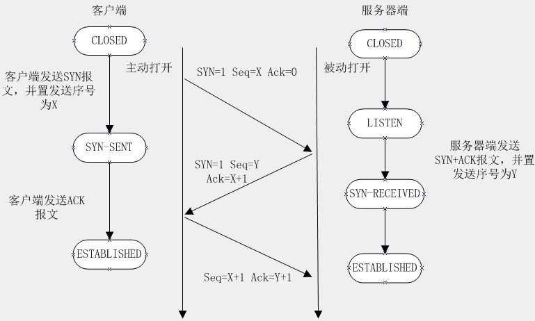

<!--more-->

[TOC]

# HTTP协议以及整个过程
  在面试过程被问到网页HTTP请求的整个过程, 这也是基础知识很重要的部分:

## HTTP基础知识
  * **HTTP协议:** 超文本传输协议, 用于客户端浏览器和web服务器之间传输信息的协议;
  * **URL:** 统一资源定位符, 格式: 
  ```txt
  格式: http://host[:post][abs_path]
  # http: 传输协议
  # host: 主机域名/IP地址
  # post: 端口号
  # abs_path: 资源路径
  ```
  * **发送请求时所要发送的信息:**
  * * **请求行:** 请求方法+URL+http协议版本, `POST index.php HTTP1.0`
  * * **请求头部:** 用键值对表示，如Accept-Charst:utf-8，指定客户端接收的字符集;
  * * **空行:** 通知请求头部结束;
  * * **请求包体:** 由数据头部信息和数据内容组成，数据头部规定了数据的类型、长度、编码等信息（post方法有请求数据，get方法不能发送请求数据）;
  * **响应后返回的数据信息**
  * * **状态行:** 协议版本+状态码（如常见的404,500,200）+状态码文本描述；`HTTP1.1 200 OK`
  * * **响应头部:** 用键值对表示；
  * * **空行:** 响应头部结束；
  * * **响应数据:** 服务器返回的数据内容和数据头部信息（head请求无响应数据）

## HTTP请求和响应的过程
### 域名解析
  在客户端域名解析是存在解析顺序的
  1. 浏览器缓存: 浏览器的DNS缓存中查找域名对应的IP地址, 并确定是否过期
  2. 系统缓存: 在客户度主机的DNS中查找
  3. 读取本地的host文件; 
  4. 路由器缓存: 在路由器的缓存中查找DNS
  5. ISP缓存: 向ISP(互联网服务提供商)的DNS服务器中查询

### 封装HTTP请求包
  把以上部分结合本机自己的信息，封装成一个HTTP请求数据包

### 封装TCP包, 建立TCP连接(TCP三次握手)


### 客户端向服务器发送HTTP请求
  建立连接后，客户机发送一个请求给服务器，请求方式的格式为：统一资源标识符（URL）、协议版本号，后边是MIME信息包括请求修饰符、客户机信息和可内容

### 服务器响应客户端
  服务器接到请求后，给予相应的响应信息，其格式为一个状态行，包括信息的协议版本号、一个成功或错误的代码，后边是MIME信息包括服务器信息、实体信息和可能的内容。

  实体消息是服务器向浏览器发送头信息后，它会发送一个空白行来表示头信息的发送到此为结束，接着，它就以Content-Type应答头信息所描述的格式发送用户所请求的实际数据
### 释放连接
  一般情况下，一旦Web服务器向浏览器发送了请求数据，它就要关闭TCP连接，然后如果浏览器或者服务器在其头信息加入了这行代码
  ```conf
    Connection:keep-alive
  ```
  TCP连接在发送后将仍然保持打开状态，于是，浏览器可以继续通过相同的连接发送请求。保持连接节省了为每个请求建立新连接所需的时间，还节约了网络带宽。

  **参考**:
  [http请求和响应全过程](http://blog.csdn.net/Picking_up_stones/article/details/62894194)
  [Http工作过程](http://www.cnblogs.com/chyg/p/5212008.html)
  [网页http请求的整个过程](http://blog.csdn.net/allenjay11/article/details/51788026)