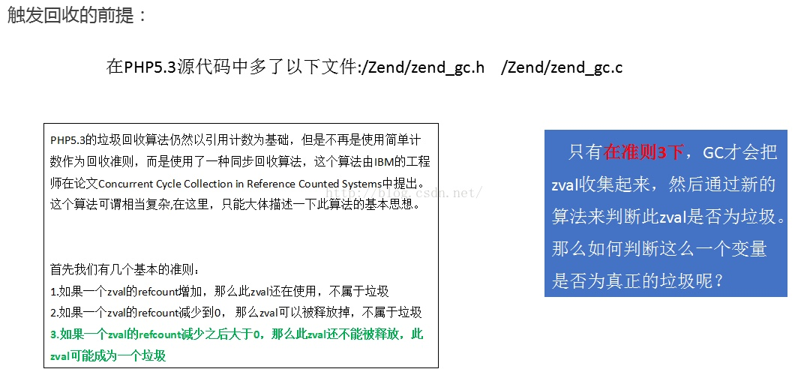
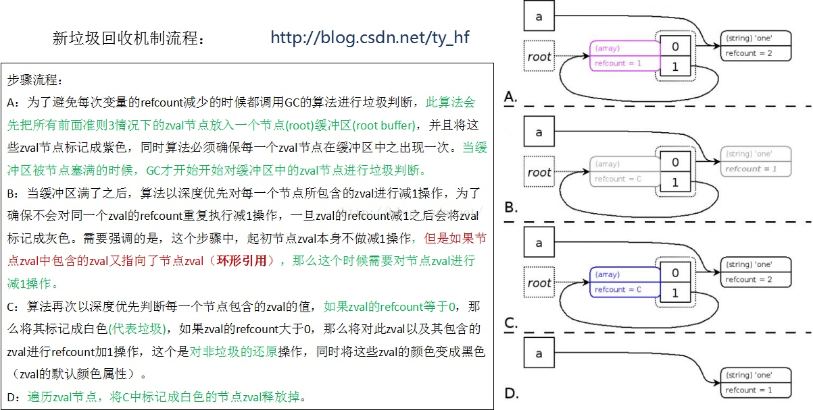

<!--more-->

[TOC]

# PHP5.3之前版本内存泄漏问题
  对于一般的php脚本，一般都不用考虑内存泄露和垃圾回收的问题，因为一般情况下你的脚本很快就执行完退出了,但是如果比较复杂的php脚本或者不合理编程的确会造成内存泄漏的问题; 内存泄漏是指进称在执行过程中，内存的占有率逐步升高，不释放， 系统所拥有的可用内存越来越少的现象。（PHP Fatal error: Allowed memory size of 134217728 bytes exhausted）

## PHP的垃圾回收机制
  对于Phper来说, 垃圾回收真的不会去注意到, 因为php是高级语言, 已经实现垃圾回收, 但是也是听过底层来实现而出发垃圾回收, 所以会存在问题
  > php 5.3之前使用的垃圾回收机制是单纯的“引用计数”，也就是每个内存对象都分配一个计数器，当内存对象被变量引用时，计数器+1；当变量引用撤掉后，计数器-1；当计数器=0时，表明内存对象没有被使用，该内存对象则进行销毁，垃圾回收完成。

  > “引用计数”存在问题，就是当两个或多个对象互相引用形成环状后，内存对象的计数器则不会消减为0；这时候，这一组内存对象已经没用了，但是不能回收，从而导致内存泄露。

  > php5.3开始，使用了新的垃圾回收机制，在引用计数基础上，实现了一种复杂的算法，来检测内存对象中引用环的存在，以避免内存泄露, 可参考[PHP内核--内存泄漏与新垃圾回收机制](http://blog.csdn.net/ty_hf/article/details/52906258)

  > 
  > 

## 影响PHP垃圾回收
  1. **垃圾回收的时机**
    PHP中，引用计数为0，则内存立刻释放。也就是说，不存在环状引用的变量，离开变量的作用域，内存被立刻释放。环状引用检测则是在满足一定条件下触发，所以在上面的例子中，会看到使用的内存有大幅度的波动。也可以通过 gc_collect_cycles 函数来主动进行环状引用检测。
  2. **&符号(引用)的影响**
    显式引用一个变量，会增加该内存的引用计数：
    $a = "something";
    $b = &$a;
    此时unset($a), 但是仍有$b指向该内存区域的引用，内存不会释放。  
  3. **unset函数的影响**
    unset只是断开一个变量到一块内存区域的连接，同时将该内存区域的引用计数-1；在上面的例子中，循环体内部，$a=new A(); unset($a);并不会将$a的引用计数减到零；
  4. **赋值null操作的影响**
    $a = null 是直接将$a 指向的数据结构置空，同时将其引用计数归0。
  5. **脚本执行结束的影响**
    脚本执行结束，该脚本中使用的所有内存都会被释放，不论是否有引用环

  **参考**
  [PHP的内存泄露问题与垃圾回收](http://www.nowamagic.net/librarys/veda/detail/1377)
  [php 内存泄漏](http://www.cnblogs.com/agang-php/p/5520489.html)
  [PHP内核--内存泄漏与新垃圾回收机制](http://blog.csdn.net/ty_hf/article/details/52906258)

  