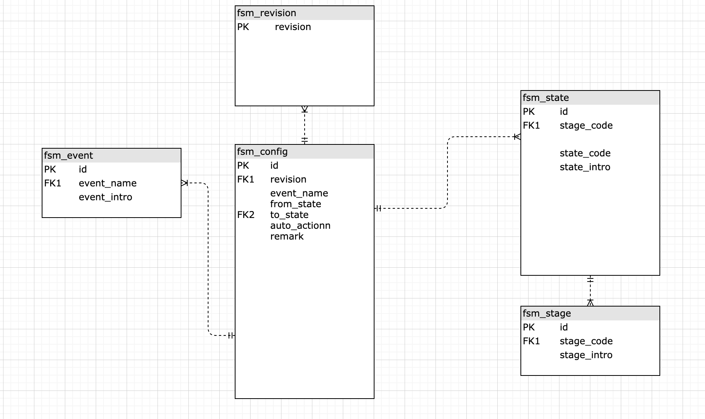

[TOC]

# 流程引擎配置化项目 - 设计

## 实现目的

在开发过程中, 其实大多数在开发过程中, 都是实现业务流程, 有一部分流程是可以重复使用的, 但是需要程序员做大量开发来完成, 为此, 个人认为是否可以通过有限状态机来实现配置化的流程, 以减少开发的工作量, 提高效率

## 基本思路

1. 利用有限状态机来作为流程引擎, 完成状态流程和配置化

2. 将所有流程打碎, 分为各个阶段, 每个阶段内只做一件事情, 从而实现阶段性的统一和标准化

3. 根据业务流程属性, 来组合和使用不同的阶段, 已达到可配置化

4. 针对不同的业务流程通过状态机版本来实现, 从而做到各业务线在流程上的差异, 同时也实现了在相同阶段的标准流程

## 举例说明:

以金融车贷订单流程来说:

**创建订单   ->   提交信审 -> 信审结果 -> 选择产品 -> 产品审核 -> 产品审核结果 -> 补充材料 -> 材料审核 -> 材料审核结果 ......**

所以, 将这个流程拆为

**创建订单阶段 -> 信审阶段 -> 产品阶段 -> 材料阶段 .....**

然后, 完善**每个阶段**中**初始状态**、**进行中状态**、**结果状态**， 以及对应可能存在的**事件**来触发不同**状态**间的流转和操作

## 数据库设计

1. 表介绍

   1. fsm_revision:  存放状态机版本信息, 用来管理状态机的版本
   2. fsm_event: 存放状态机中事件信息, 用来做标准的逻辑处理, 即: 该事件下处理逻辑是统一标准化的
   3. fsm_stage: 存放状态机中的阶段信息, 用来定义阶段信息, 以及阶段使用的 code, 方便配置流程时选择 state 的流转
   4. fsm_state: 存放每个阶段下对应具体的 state, 方便在选择完阶段后, 配置流转
   5. fsm_config: 存放不同流程, 用来管理流程流转

2. 表结构

   ```sql
   # fsm_revision
   CREATE TABLE `fsm_revision` (
     `revision` int unsigned NOT NULL AUTO_INCREMENT COMMENT '版本',
     `revision_intro` text CHARACTER SET utf8mb4 COLLATE utf8mb4_unicode_ci COMMENT '版本介绍',
     `created_at` timestamp NOT NULL DEFAULT CURRENT_TIMESTAMP COMMENT '创建时间',
     `updated_at` timestamp NOT NULL DEFAULT CURRENT_TIMESTAMP ON UPDATE CURRENT_TIMESTAMP COMMENT '更新时间',
     PRIMARY KEY (`revision`)
   ) ENGINE=InnoDB DEFAULT CHARSET=utf8mb4 COLLATE=utf8mb4_unicode_ci COMMENT='状态机版本管理';
   
   # fsm_event
   CREATE TABLE `fsm_event` (
     `id` int unsigned NOT NULL AUTO_INCREMENT COMMENT '主键自增',
     `event_name` varchar(100) CHARACTER SET utf8mb4 COLLATE utf8mb4_unicode_ci DEFAULT NULL COMMENT '事件名称',
     `event_intro` varchar(255) CHARACTER SET utf8mb4 COLLATE utf8mb4_unicode_ci DEFAULT NULL COMMENT '事件简介',
     `created_at` timestamp NOT NULL DEFAULT CURRENT_TIMESTAMP COMMENT '创建时间',
     `updated_at` timestamp NOT NULL DEFAULT CURRENT_TIMESTAMP ON UPDATE CURRENT_TIMESTAMP COMMENT '更新时间',
     PRIMARY KEY (`id`),
     UNIQUE KEY `uniq_event_name` (`event_name`)
   ) ENGINE=InnoDB DEFAULT CHARSET=utf8mb4 COLLATE=utf8mb4_unicode_ci COMMENT='状态机事件管理';
   
   # fsm_stage
   CREATE TABLE `fsm_stage` (
     `id` int unsigned NOT NULL AUTO_INCREMENT COMMENT '主键自增',
     `stage_code` int unsigned NOT NULL DEFAULT '0' COMMENT '阶段状态码, 例如: 10000000',
     `stage_intro` varchar(255) CHARACTER SET utf8mb4 COLLATE utf8mb4_unicode_ci DEFAULT NULL COMMENT '阶段状态码描述',
     `created_at` timestamp NOT NULL DEFAULT CURRENT_TIMESTAMP COMMENT '创建时间',
     `updated_at` timestamp NOT NULL DEFAULT CURRENT_TIMESTAMP ON UPDATE CURRENT_TIMESTAMP COMMENT '更新时间',
     PRIMARY KEY (`id`),
     UNIQUE KEY `uniq_stage_code` (`stage_code`)
   ) ENGINE=InnoDB DEFAULT CHARSET=utf8mb4 COLLATE=utf8mb4_unicode_ci COMMENT='状态机阶段状状态码管理';
   
   # fsm_state
   CREATE TABLE `fsm_state` (
     `id` int unsigned NOT NULL AUTO_INCREMENT COMMENT '主键自增',
     `stage_code` int unsigned NOT NULL DEFAULT '0' COMMENT '阶段状态码, 例如: 10000000',
     `state_code` int unsigned NOT NULL DEFAULT '0' COMMENT '状态码',
     `state_intro` varchar(255) CHARACTER SET utf8mb4 COLLATE utf8mb4_unicode_ci DEFAULT NULL COMMENT '状态码描述',
     `created_at` timestamp NOT NULL DEFAULT CURRENT_TIMESTAMP COMMENT '创建时间',
     `updated_at` timestamp NOT NULL DEFAULT CURRENT_TIMESTAMP ON UPDATE CURRENT_TIMESTAMP COMMENT '更新时间',
     PRIMARY KEY (`id`),
     UNIQUE KEY `uniq_state_code` (`state_code`),
     KEY `idx_stage_code` (`stage_code`)
   ) ENGINE=InnoDB DEFAULT CHARSET=utf8mb4 COLLATE=utf8mb4_unicode_ci COMMENT='状态机状态码管理';
   
   # fsm_config
   CREATE TABLE `fsm_config` (
     `id` int unsigned NOT NULL AUTO_INCREMENT,
     `revision` int unsigned NOT NULL DEFAULT '0' COMMENT '状态机版本',
     `event_name` varchar(100) COLLATE utf8mb4_unicode_ci NOT NULL DEFAULT '' COMMENT '事件名称',
     `from_state` int NOT NULL DEFAULT '0' COMMENT '状态起始态',
     `to_state` int NOT NULL DEFAULT '0' COMMENT '状态流转态',
     `remark` varchar(255) COLLATE utf8mb4_unicode_ci NOT NULL DEFAULT '' COMMENT '事件描述',
     `auto_actionn` varchar(100) COLLATE utf8mb4_unicode_ci NOT NULL DEFAULT '' COMMENT '自动触发下一个事件, 默认不触发',
     `is_delete` tinyint(1) NOT NULL DEFAULT '0' COMMENT '是否删除 0: 未删除; 1: 已删除',
     `created_at` timestamp NOT NULL DEFAULT CURRENT_TIMESTAMP COMMENT '创建时间',
     `updated_at` timestamp NOT NULL DEFAULT CURRENT_TIMESTAMP ON UPDATE CURRENT_TIMESTAMP COMMENT '更新时间',
     `deleted_at` timestamp NULL DEFAULT NULL COMMENT '删除时间',
     PRIMARY KEY (`id`),
     UNIQUE KEY `multilple_uni` (`revision`,`event_name`,`from_state`)
   ) ENGINE=InnoDB DEFAULT CHARSET=utf8mb4 COLLATE=utf8mb4_unicode_ci COMMENT='状态机配置表';
   ```

3. 数据库视图

## 代码实现

1. 